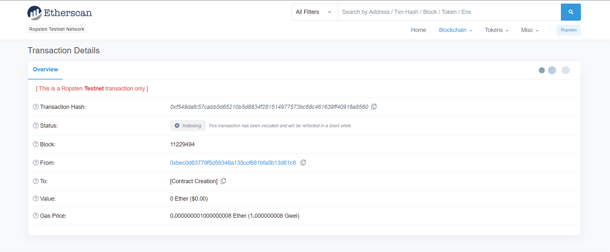
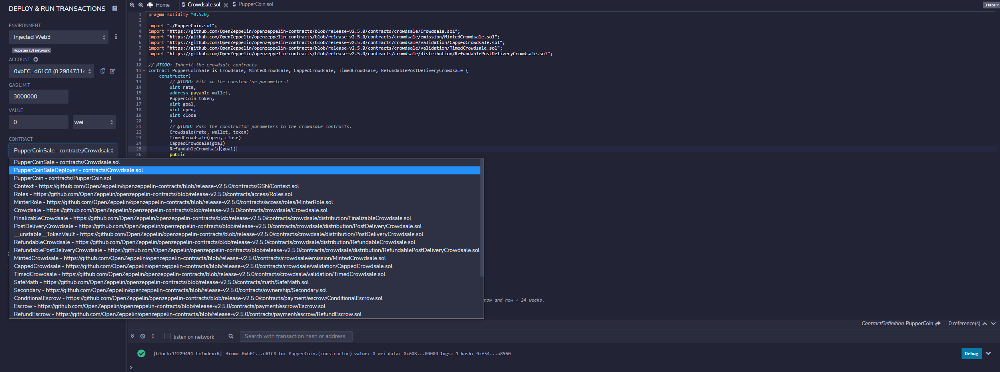

# PupperCoin-Crowdsale by John Mangahas

The starter code creates an ERC20 token that will be minted through a Crowdsale contract using the OpenZeppelin Solidity Library. The Crowdsale contract will execute the entire process, allowing the developer to send ETH in exchange for PUP (PupperCoin). This contract main function is to mint tokens and transact with buyers. The Crowdsale contract will also allow transactions to be refunded once the crowdfunding goal has been met. The Crowdsale contract will deploy three smart contracts: PupperCoin, PupperCoinSaleDeployer, and PupperCoinSale. The following contracts have been deployed using Ropsten Test Network. 

* test_wallet_address: 0xbEC0d63779f5d59346a135cCf681bFa5B13d61C8
* token_address: 0x5C89033b300581C3E728301Cf8f76213183BE9B1
* token_sale_address: 0x400bD04451Cfcd513aCb25cf8CfE10101829ca6d

----

# Deployment Tools

* [Remix - Smart Contract IDE](https://remix.ethereum.org/)

* [Metamask](https://metamask.io)

----

# Solidity Notebooks

* [PupperCoin Notebook](PupperCoin.sol)
* [Crowdsale Notebook](Crowdsale.sol)

----

# Deployment

## 1. Compile both notebooks and make sure your code is correct.

* Compile and Deploy PupperCoin

* Compile and Deploy Crowdsale

## 2. Create ERC20 Tokens

* Make sure to input the proper name `PupperCoin` and symbol `PUP`. For this example I set the initial supply for 300,000,000,000,000,000,000 wei or 300 ETH.

* Deploy contract and verify.

## 3. Crowdsaledeployer

* After creating the token, you can now proceed to deploy the `crowdsaledeployer` contract. 

* Verify deployment variables and make sure to input your test wallet

* Deploy contract and verify transaction

* Double check using etherscan

* After deploying the contract you will now have access to your `token_address` and `token_sale_address`

* Copy the `token_sale_address`and paste the address to the `At Address` variable input

## 4. PupperSaleCoin

* If done correctly. A new contract can be deployed called `puppercoinsale`

* Next step is to buy and mint tokens. Make sure to fill in the correct address in the buy token field.

* Verify address and initiate transaction

* Confirm and accept the transaction 

* Verification of trasanction using etherscan.

## 5. Importing test token to metamask

* Open metamask account and click the `assets` tab.

* Copy and paste the `token_address` from your contract.
You can choose to edit the token symbol and token decimal

* Accept and import custom token to your metamask account.

## 6. Verification of Balance

* While waiting for your metamask to refresh you can use Remix to verify the balance of your token account.

* You can also check using etherscan via Metamask. You can also verify contract hash

